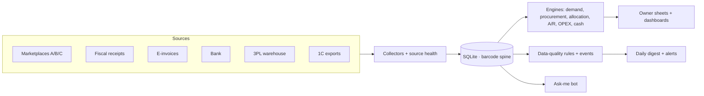
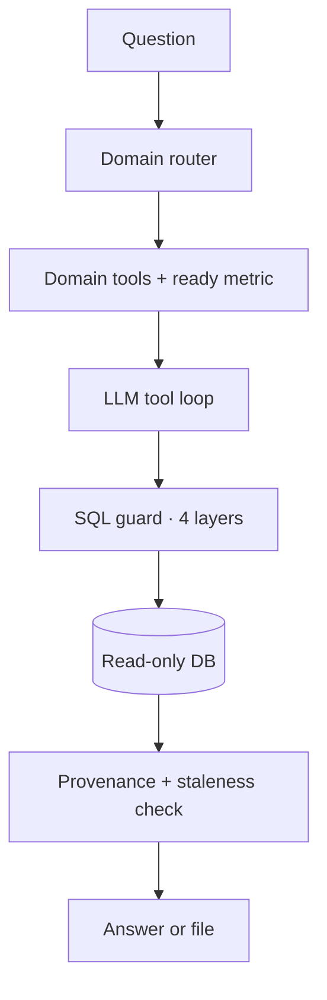
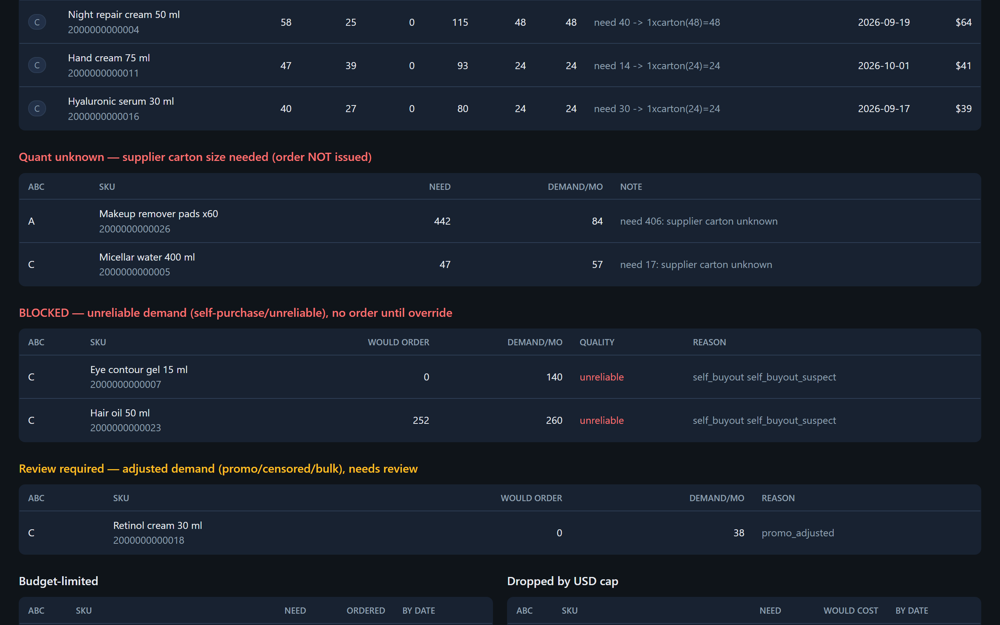
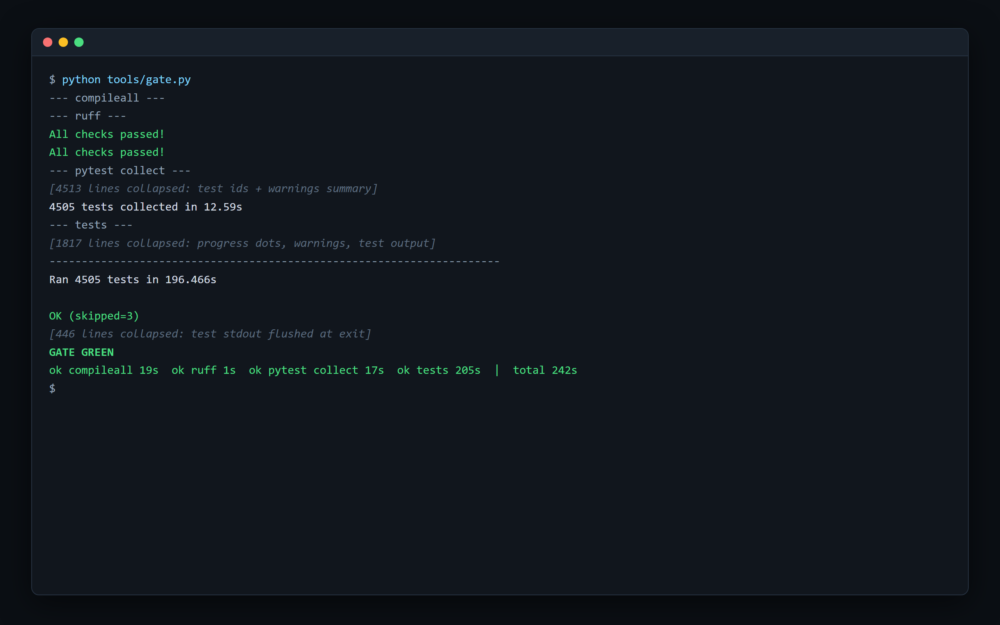

# Marketplace Control Tower

One system that pulls every source a distributor's business depends on into one database, reconciles the sources against each other, and turns them into decisions its owner can check.

**since Jun 2026, active · 709 commits · Python · SQLite · code: private**
## The problem

A cosmetics distributor in Uzbekistan sells through three marketplaces, wholesale buyers and retail chains. It keeps its books in 1C, stores goods at a third-party warehouse, and every sale also shows up as a fiscal receipt filed with the tax authority and as a national e-invoice. That makes five or six systems describing the same transaction, and they disagree: documents get mirrored, cancelled and reissued, fees are withheld or invoiced separately, and codes that look like product IDs aren't unique.

Before this system, reconciling them, forecasting demand and planning imports with long lead times meant spreadsheets and manual cross-checking. A wrong total looked exactly as convincing as a right one.

## What it does

- **Collects everything unattended**, three times a day: marketplace APIs, the warehouse portal, fiscal receipts, e-invoices, bank payments, mail and 1C exports. Every source reports its own health.
- **Reconciles money** across settlement reports, fiscal receipts, bank and ledger, per product and period, with evidence. A missing source shows as "no data", never as zero.
- **Forecasts demand** per product and channel from receipts and e-invoices, not marketplace estimates.
- **Plans procurement** against lead time, carton sizes, minimum orders and shelf life, which differs by channel.
- **Tracks receivables, OPEX, margin, credit risk and a 13-week cashflow** in owner reports with a freshness line on every sheet.
- **Answers questions in plain language** over Telegram or a web chat, using read-only SQL, with every number tagged by source and period.
- **Recommends, never acts**: procurement lines are firm, need review, or are blocked. The owner decides.

## How it works

Layers talk through the database schema, not Python imports. A table-ownership registry says who may write each table. Tables rebuilt from the network go through staging and an atomic swap, so a failed fetch never leaves a half-empty table.

## Engineering notes

- **Barcode is the only product key.** The national product-type code looks like a key, but dozens of products share one. Records without a barcode are resolved by name and stay flagged as unresolved if the match isn't certain.
- **Unknown is not zero.** A missing cost parameter, carton size or payment term stays unknown and is labelled that way downstream, so it never turns into a plausible but invented number.
- **Snapshots and registers are different things.** Most tables are append-only snapshots (read the latest one), but in-transit invoices are a register (read all open rows). Mixing the two up caused real bugs, and each case is now pinned by a named invariant and a regression test.
- **Guards refuse to publish broken numbers.** If total demand or stock inputs collapse against the previous run, the procurement step fails and the last valid plan stays on display.
- **Model choice by backtest.** A walk-forward harness compared forecast variants on history. Exponential smoothing replaced the old method for one marketplace channel (cumulative 3-month WAPE 0.42 → 0.37 on the top class). Wholesale kept a robust median, because no variant beat it.
- **An LLM that cannot write.** SQL runs through four independent layers: a read-only connection, a statement authorizer that allows only reads, validation, and a runtime deadline. File contents sent to the bot are wrapped as data, not instructions. The layer that drafts external actions runs dry-run only and cannot be imported by the question-answering stack.
- **Built with coding agents on purpose.** 807 Claude Code and Codex sessions. The human work was specifying invariants and auditing the results, recorded in a 200+ entry decision log.

## How it is verified

- **One-command gate**: compile, lint, two test runners, 4,000+ tests and a coverage floor (73.7 % branch coverage at the last baseline).
- **Full-cycle regression**: every engine runs on a copy of the live database, and key metrics are diffed against their history. Any shift over 2 % must be explained.
- **Golden questions for the bot**: a contract suite runs on a fixture database with planted stale-snapshot traps. A nightly judge checks live answers against canonical metrics for the named period, with a separate LLM review and a check on attached files.
- **Independent adversarial audits** by read-only agents, working from written charters. Findings are verified before anything is fixed.
- **Refactoring baselines**: the offline engine chain went from 19 s to 1 s with a zero metric diff.

## Stack

Python 3.14, SQLite (WAL), pandas, openpyxl, pdfplumber, Playwright, stdlib `http.server` dashboards, Google Sheets API, Telegram Bot API, OpenAI and Anthropic model APIs, 1C, Didox e-invoicing, the national e-signature client, Windows Task Scheduler, PowerShell, pytest/unittest, ruff.

## Screenshots

_The real code running on synthetic data. No client data appears anywhere._

*Marketplace analytics dashboard: the freshness strip flags one stale source (Marketplace B stock, 52 h old, last collection incomplete) above the supply signal with days to stockout, cover, reorder deficit and shelf-life risk per SKU; labels translated from Russian.*

*Procurement plan gating: firm order lines rounded to supplier cartons, lines held back for an unknown carton size, demand blocked as unreliable (suspected self-purchase) and a promo-adjusted line sent to review; labels translated from Russian.*

*The one-command quality gate (compileall, ruff on two roots, pytest collection, then 4,505 unit tests) finishing green in about four minutes; real output with the long test-id and progress blocks collapsed, verdict labels translated from Russian.*

## Access

The code is private because it runs a live business. To request a walkthrough or read access, open an issue in this repository or email eazamat360@gmail.com.
